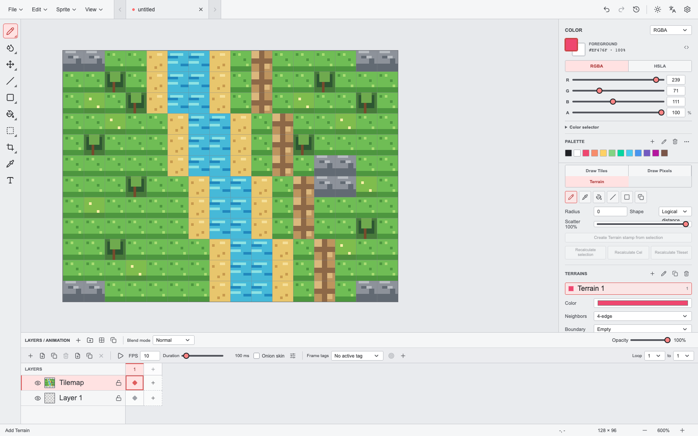

<p align="center">
  
</p>

<h1 align="center">Pixtorio</h1>

<p align="center">A local pixel-art and frame-animation editor.</p>

<p align="center">
  <a href="https://github.com/MiguelValentine/pixtorio/releases">Download</a> ·
  <a href="#quick-start">Quick start</a> ·
  <a href="#features">Features</a> ·
  <a href="#build">Build</a> ·
  <a href="#contributing">Contributing</a> ·
  <a href="README_zh-CN.md">简体中文</a>
</p>



Pixtorio is a pixel-art and frame-animation editor inspired by the Aseprite workflow. Its desktop shell is built with Wails and Go; the editor uses React, TypeScript, Vite, and Canvas 2D. The same frontend can also run in a browser for local import and export workflows.

The default interface is Simplified Chinese with a light theme. Both language and theme can be changed in Preferences. Windows is the primary desktop target; Pixtorio can also be built locally for Apple Silicon macOS.

## Features

- **Pixel creation**: pencil, eraser, eyedropper, fill, gradient, spray, contour, exact-color replacement, shapes, curves, multiline text, pixel-perfect zooming, panning, grids, guides, symmetry, and tiled previews.
- **Brushes and colour**: shape, bitmap, and pattern brushes; brush presets; pressure and velocity dynamics; RGBA/HSLA editing; palette management; indexed colour; colour wheel; and tint, tone, and shade selectors.
- **Layers and animation**: nested groups, all 19 Aseprite raster blend modes, background/reference layers, per-cel opacity and Z-index, a timeline, linked cels, tags, onion skinning, and detached animation previews.
- **Selection and transforms**: rectangle, ellipse, lasso, polygon, magic-wand, colour, and opaque-content selections; boolean operations, feathering, grow/shrink, copy/paste, and selection, cel, and document transforms.
- **Effects and assets**: brightness/contrast, HSL, curves, convolution, outline, shading, tilemaps, slices, ICC colour profiles, pixel aspect ratios, history, recovery, and configurable shortcuts.
- **Interchange**: PNG, GIF, sprite sheets, packed atlases, image sequences, and GPL/JASC-PAL palettes, with configurable frame ranges, directions, tags, and layer splitting.

## Quick Start

### Prerequisites

- Go `1.27` or newer
- Node.js `24` or newer
- Wails CLI `v2.15.0`
- WebView2 Runtime for Windows desktop builds
- Xcode Command Line Tools for local macOS builds

Install the Wails CLI and frontend dependencies:

```bash
go install github.com/wailsapp/wails/v2/cmd/wails@v2.15.0
npm --prefix frontend install
```

Start the desktop app in development mode:

```bash
wails dev
```

Run the browser frontend only:

```bash
npm --prefix frontend run dev -- --host 127.0.0.1
```

Browser mode supports local project, PNG, palette, sprite-sheet, and image-sequence import, plus downloaded `.pixio`, PNG, GIF, sprite-sheet, and image-sequence exports. Native dialogs, recent-project paths, atomic saves, and MCP require the desktop application.

## Build

Run the full verification suite:

```bash
npm --prefix frontend run check
npm --prefix frontend test
npm --prefix frontend run build
go test ./...
```

Build a production application for the current platform:

```bash
wails build
```

The Windows executable is written to `build/bin/Pixtorio.exe`. To build an Apple Silicon macOS app bundle:

```bash
wails build -platform darwin/arm64
```

The macOS bundle is written to `build/bin/Pixtorio.app`. A release distributed to end users must be signed and notarized with your own Apple Developer ID.

## Project Files

`.pixio` is Pixtorio's only editable project format. The current format is a strict `.pixio v4` ZIP container containing canvas, layers, frames, cels, palettes, tilesets, tilemaps, slices, guides, colour profiles, settings, and thumbnails.

v4 intentionally rejects older projects: v1-v3 files are not migrated, downgraded, or opened through a compatibility reader. PNG, GIF, sprite sheets, atlases, and image sequences are interchange formats, not project formats.

## Project Status

Pixtorio has a broad baseline across pixel editing, animation, compositing, import/export, history, and MCP, but it does not claim complete Aseprite parity. The feature inventory and verification checkpoint are tracked in [AGENTS.md](AGENTS.md).

Automation/CLI interfaces, scripting and plugin APIs, cloud synchronization, installer maintenance, and `.aseprite` compatibility are explicitly out of scope.

## MCP

The desktop app supports local MCP integration through `Pixtorio.exe --mcp`. It can access the active editor's documents, layers, frames, pixels, palettes, tilemaps, previews, and exports while sharing UI undo/redo history.

See [MCP.md](MCP.md) for protocol details, limits, and security guidance. MCP is a local desktop integration, not a remote service or a general-purpose scripting environment.

## Contributing

Issues and pull requests are welcome. Before submitting a change:

1. Keep the change focused and follow the existing TypeScript, React, and Go conventions.
2. Add focused tests for behavioural changes.
3. Run the full verification suite listed above.
4. Do not add migration, compatibility reading, or compatibility tests for `.pixio v1-v3`.

See [AGENTS.md](AGENTS.md) and [RELEASE.md](RELEASE.md) for the full engineering and release-verification requirements.

## License

This repository currently has no license file. Until an explicit license is added, no permission is granted to copy, modify, or distribute the project.
